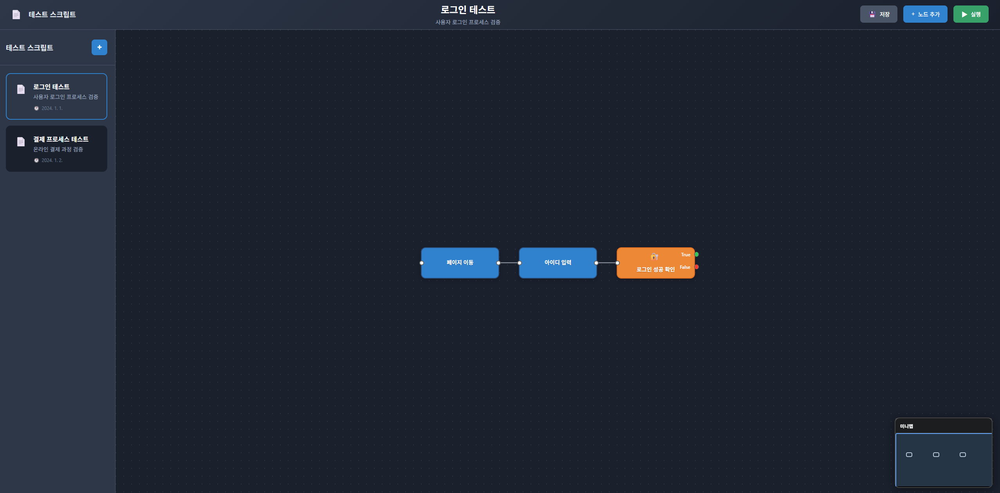

# AutoScript

자동화를 위한 FastAPI 서버와 웹 기반 UI 도구입니다.

## 📸 웹 UI 미리보기


## 시스템 요구사항

- **Python**: 3.10.6 이상
- **운영체제**: Windows 10/11
- **메모리**: 최소 4GB RAM 권장
- **디스크**: 최소 1GB 권장

## 설치 및 실행

### 1. 저장소 클론
```bash
git clone <repository-url>
cd AutoScript
```

### 2. 가상환경 생성 및 활성화
```bash
python -m venv venv
venv\Scripts\activate
```

### 3. 패키지 설치
```bash
cd server
pip install -r requirements.txt
```

### 4. 서버 실행
```bash
cd server
python -m uvicorn main:app --reload --host 0.0.0.0 --port 8000
```

### 5. 웹 브라우저에서 접속
브라우저에서 `http://localhost:8000` 접속

## 사용 방법

### 워크플로우 생성
1. 웹 UI에서 "노드 추가" 버튼을 클릭하거나 `Ctrl+N` 단축키를 활용해 노드를 생성합니다.
2. 원하는 노드 타입을 선택합니다 (클릭, 이미지 터치, 대기 등)
3. 노드를 캔버스에 배치하고 연결합니다
4. 각 노드의 설정을 조정합니다 (노드 더블클릭 또는 노드 우측 상단의 설정 버튼 클릭)

### 워크플로우 저장
- `Ctrl+S` 키를 누르거나 저장 버튼을 클릭합니다
- 워크플로우 이름을 입력하고 저장합니다

### 워크플로우 실행
- `F5` 또는 `Ctrl+R` 키를 누르거나 실행 버튼을 클릭합니다
- 실행 중인 노드는 주황색으로 표시되고, 완료된 노드는 초록색으로 표시됩니다

### 키보드 단축키
- `Ctrl+N`: 노드 추가
- `Ctrl+S`: 워크플로우 저장
- `F5` / `Ctrl+R`: 워크플로우 실행
- `Delete`: 선택한 노드 삭제

## 주요 기능

- **시각적 워크플로우 편집기**: 드래그 앤 드롭으로 노드 기반 스크립트 생성
- **다양한 노드 타입**: 클릭, 이미지 터치, 대기, 조건 분기, 루프 등
- **실시간 실행 모니터링**: 실행 중인 노드를 시각적으로 확인
- **워크플로우 저장/로드**: 생성한 워크플로우를 저장하고 나중에 불러오기

## 문서

### 사용자 가이드
- **[데이터베이스 사용 가이드](docs/database.md)**: 데이터베이스 사용 및 샘플 데이터 삽입 방법

### 개발자 가이드
- **[개발 환경 설정](docs/dev/development.md)**: 개발 환경 설정, 서버 실행, 배포 방법
- **[프로젝트 구조](docs/dev/project-structure.md)**: 프로젝트 폴더 구조 및 각 디렉토리 역할
- **[시스템 아키텍처](docs/dev/architecture.md)**: 서버/클라이언트 역할 및 시스템 구조
- **[API 참조 문서](docs/dev/api-reference.md)**: RESTful API 엔드포인트 상세 설명
- **[노드 추가 가이드](docs/dev/node.md)**: 새로운 노드 타입을 추가하는 방법
- **[환경 변수 설정](docs/dev/environment.md)**: 개발/프로덕션 모드 환경 변수 설정
- **[워크플로우 구조](docs/dev/workflow-structure.md)**: 워크플로우 페이지 코드 구조 설명
- **[코드 린팅 가이드](docs/dev/linting.md)**: 코드 품질 관리 및 린팅 사용법

## 라이선스

Apache-2.0 license

## 기여

이슈 및 풀 리퀘스트를 환영합니다.

### 코드 기여 전 확인사항

코드를 기여하기 전에 다음을 확인해주세요:

1. **Python 코드 품질 검사**: 린팅과 포매팅을 실행해주세요
   ```bash
   # 개발 의존성 설치
   pip install -r server/requirements-dev.txt
   
   # 린팅 및 포매팅 실행
   ruff check --fix server/
   ruff format server/
   ```

2. **JavaScript 코드 품질 검사**: 린팅과 포매팅을 실행해주세요
   ```bash
   # UI 디렉토리로 이동
   cd UI
   
   # 의존성 설치 (최초 1회만)
   npm install
   
   # 린팅 실행 (오류 확인)
   npm run lint
   
   # 린팅 자동 수정
   npm run lint:fix
   
   # 코드 포매팅
   npm run format
   ```

자세한 내용은 [코드 린팅 가이드](docs/dev/linting.md)와 [JavaScript 린팅 가이드](docs/lint/javascript-linting.md)를 참고하세요.

## 주의사항

- 자동화 하려는 프로그램의 이용약관을 준수하여 사용하세요
- 자동화 사용으로 인한 계정 제재에 대한 책임은 사용자에게 있습니다
